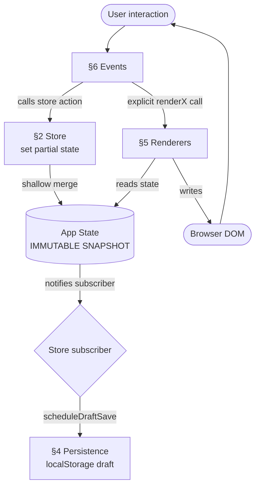
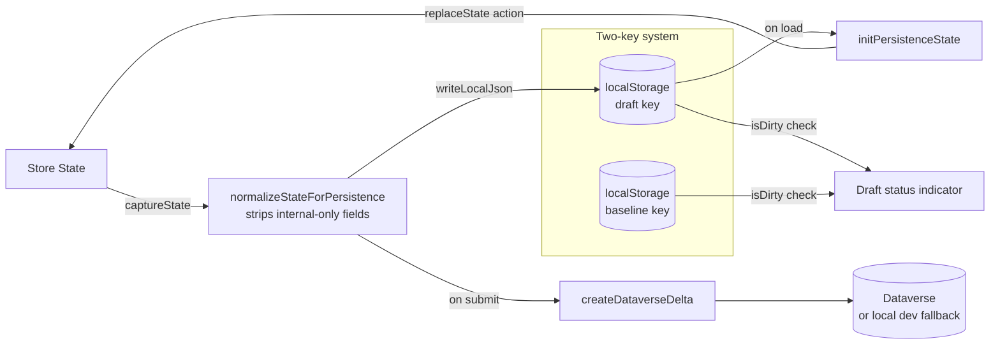
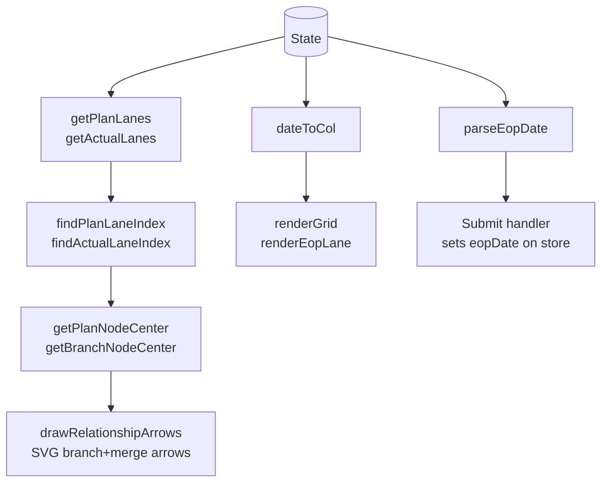

# Model Timeline Planner

A single-page web application for planning and tracking automotive project model timelines. Visualises plan vs. actual stages on a scrollable month-column grid, with variant lanes, branches, merge links, and EOP tracking. Built for Microsoft Power Pages — zero dependencies, single JS file, no build step.

---

## Architecture

The codebase is one file (`app.js`) divided into seven clearly delimited sections:

```
§1  CONSTANTS + CORE UTILITIES   — COL, ROH, $, fmtDate, cloneState, stableStringify
§2  STORE                        — Zustand-style reactive store: createStore + appStore
§3  DOMAIN                       — Pure functions: lane layout, grid math, EOP parsing
§4  PERSISTENCE                  — localStorage draft/baseline, Dataverse payload builder
§5  RENDERERS                    — DOM writers that receive state and never mutate it
§6  EVENTS                       — Event handlers that call store actions
§7  BOOTSTRAP                    — Wire store subscriber, init persistence, bind, render
```

**Key rules:**
- State mutations happen **only through store actions** (`set()` in the store)
- Renderers are **pure DOM writers** — they receive `state`, write DOM, never call `set()`
- Event handlers are the **only callers of store actions**
- Transient UI state (`mergePick`, drag offsets, `pendCell`) lives as module-level variables — not persisted, not in the store

---

## Data Flow



---

## State Management (Zustand-style)

The store is created with `createStore(initializer)` — a minimal Zustand clone implemented in vanilla JS:

```js
function createStore(initializer) {
  let state;
  const listeners = new Set();

  const set = (partial) => {
    const next = typeof partial === 'function' ? partial(state) : partial;
    state = Object.assign({}, state, next);   // shallow merge
    listeners.forEach(fn => fn(state));       // notify all subscribers
  };

  const get = () => state;
  const subscribe = (fn) => { listeners.add(fn); return () => listeners.delete(fn); };

  state = initializer(set, get);
  return { getState: get, setState: set, subscribe };
}
```

State and actions live together in `appStore`:

```js
const store = createStore((set, get) => ({
  // ── Data ──
  planNodes: [],
  variants: [],
  // ...

  // ── Actions ──
  addPlanNode: (data) => set(s => ({
    planNodes: [...s.planNodes, { id: 'i' + s.nid, isDRS: false, drsDetail: '', ...data }],
    nid: s.nid + 1,
  })),
  removePlanNode: (id) => set(s => ({
    planNodes: s.planNodes.filter(n => n.id !== id),
  })),
  // ...
}));
```

---

## Persistence Layer



**Draft/baseline pattern:**
- `draft` key — auto-saved every 80ms after any state change (debounced via `scheduleDraftSave`)
- `baseline` key — only updated on successful Dataverse submit
- `isDirty(draft, baseline)` — drives the "Draft changes" indicator in the header
- "Revert" resets the draft back to the last baseline

---

## Domain Logic



All domain functions are **pure** — they take `state` as a parameter and return values without side effects.

---

## Features

### Variants and Lanes
Each variant gets a **Plan** lane and an **Actual** lane. Variants can have child **Branches** (sub-lanes) that branch off a plan node and optionally merge back via **Merge Links** (purple dashed SVG arrows).

### Stage Nodes
Click any grid cell to add a stage. Each stage has:
- **Top / Bottom labels**
- **Month** (date picker)
- **Shape** — square or circle
- **Is DRS Available?** — checkbox; when checked, a DRS Details textarea appears

Stages are draggable horizontally within their lane. Right-click for context menu (branch, merge, delete).

### EOP Table
The EOP table's date column (any column whose header contains "date" or "month") renders an `<input type="month">` picker. The value is stored as `YYYY-MM` and used directly by the submit handler to set the EOP lane on the timeline.

### PDF Export
Captures the full `.app` element via `html2canvas` and exports as A4 landscape PDF using `jsPDF`. Control buttons are hidden during capture.

### Draft Persistence
All changes auto-save to `localStorage` within 80ms. The header shows a "Draft changes" indicator when the draft differs from the last submitted baseline.

---

## Deployment (Power Pages)

1. Upload `app.js`, `style.css`, `index.html` as web files in Power Pages Studio
2. No build step, no npm, no dependencies beyond the CDN scripts in `index.html` (`html2canvas`, `jsPDF`)
3. For live Dataverse sync, implement `window.ProjectTrackerDataverse.saveProject({ projectId, delta, payload })` in a separate Power Pages script
4. Without that bridge, the app saves a Dataverse-formatted payload to `localStorage` for development inspection

---

## File Structure

```
Project-Tracker/
  app.js                         — Complete application (§1–§7)
  index.html                     — HTML shell + CDN scripts
  style.css                      — All styles (CSS custom properties, light/dark theme)
  docs/
    database/
      dataverse-schema.md        — Dataverse table schema reference
    superpowers/
      plans/
        2026-05-19-project-rewrite.md
```
