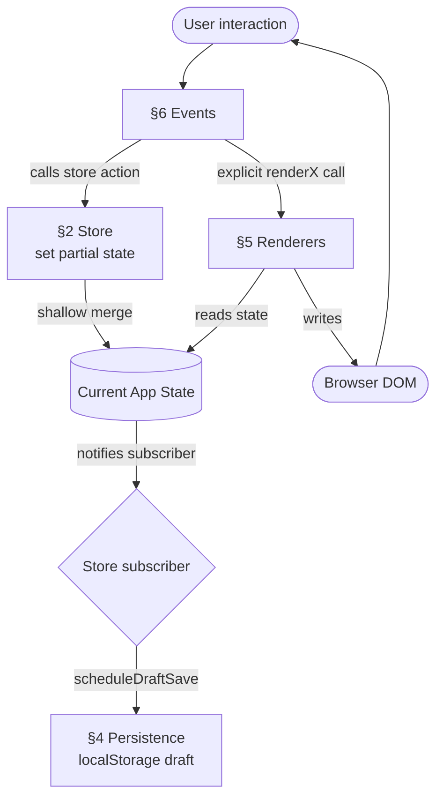
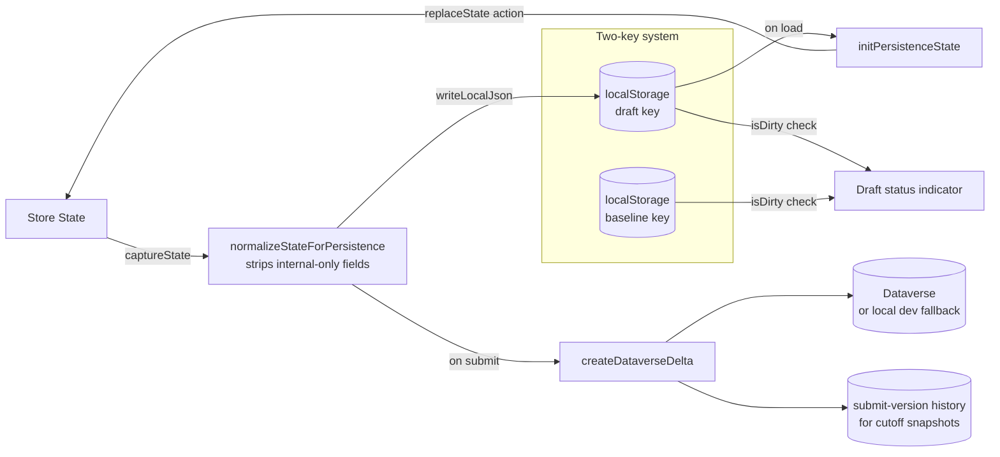
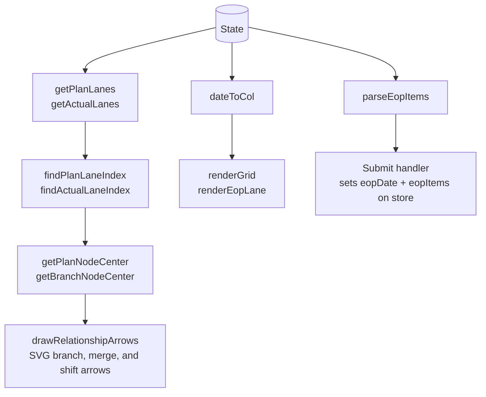

# Model Timeline Planner

A single-page web application for planning and tracking automotive project model timelines. Visualises plan vs. actual stages on a scrollable month-column grid, with variant lanes, branches, merge links, and EOP tracking. Built for Microsoft Power Pages / Power Apps deployment with one application JavaScript file (`app.js`) and no build step. PDF export uses the two CDN scripts declared in `index.html`.

---

## Architecture

The codebase is one file (`app.js`) divided into seven clearly delimited sections:

```
§1  CONSTANTS + CORE UTILITIES   — COL, ROH, $, fmtDate, cloneState, stableStringify, escapeHtml
§2  STORE                        — Zustand-style reactive store: createStore + appStore
§3  DOMAIN                       — Pure functions: lane layout, grid math, EOP parsing
§4  PERSISTENCE                  — localStorage draft/baseline, submit-version history, Dataverse payload builder
§5  RENDERERS                    — DOM writers that receive state and wire element callbacks
§6  EVENTS                       — Event handlers and element callbacks that call store actions
§7  BOOTSTRAP                    — Wire draft-save subscriber, init persistence, bind, render
```

**Key rules:**
- State mutations happen **only through store actions** (`set()` in the store)
- Renderers receive `state` and write DOM; mutations happen later through event callbacks
- Event handlers and renderer-created element callbacks are the **only callers of store actions**
- Transient UI state (`mergePick`, drag offsets, `pendCell`) lives as module-level variables — not persisted, not in the store

---

## Data Flow



---

## State Management (Zustand-style)

The store is created with `createStore(initializer)` — a minimal Zustand clone implemented in vanilla JS:

```js
function createStore(initializer) {
  let state;
  const listeners = new Set();

  const set = (partial) => {
    const next = typeof partial === 'function' ? partial(state) : partial;
    state = Object.assign({}, state, next);   // shallow merge
    listeners.forEach(fn => fn(state));       // notify all subscribers
  };

  const get = () => state;
  const subscribe = (fn) => { listeners.add(fn); return () => listeners.delete(fn); };

  state = initializer(set, get);
  return { getState: get, setState: set, subscribe };
}
```

State and actions live together in `appStore`:

```js
const store = createStore((set, get) => ({
  // ── Data ──
  planNodes: [],
  variants: [],
  // ...

  // ── Actions ──
  addPlanNode: (data) => set(s => ({
    planNodes: [...s.planNodes, { id: 'i' + s.nid, isDRS: false, drsDetail: '', ...data }],
    nid: s.nid + 1,
  })),
  removePlanNode: (id) => set(s => ({
    planNodes: s.planNodes.filter(n => n.id !== id),
  })),
  // ...
}));
```

---

## Persistence Layer



**Draft/baseline pattern:**
- `draft` key — auto-saved every 80ms after any state change (debounced via `scheduleDraftSave`)
- `baseline` key — only updated on successful Dataverse submit
- `submit-versions` key — immutable successful Submit records with `{ id, submittedAt, discussionDate, state, payload }`
- `discussion-cutoffs` key — backend-style cutoff dates used by the Timeline Version dropdown during local development
- `isDirty(draft, baseline)` — drives the "Draft changes" indicator in the header
- "Revert" resets the draft back to the last baseline

---

## Domain Logic



All domain functions are **pure** — they take `state` as a parameter and return values without side effects.

---

## Features

### Variants and Lanes
Each variant gets a **Plan** lane and an **Actual** lane. Variants can have child **Branches** (sub-lanes) in either section. Plan branches are independent from Actual branches: Plan branches start from Plan stages/months and merge back to the Plan timeline, while Actual branches start from Actual stages/months and merge back to the Actual timeline. If a merge lands beyond the last main stage in its section, that section's timeline extends to the merge month so the connector has a visible landing line.

### Stage Nodes
Click any grid cell to add a stage. Each stage has:
- **Top label**
- **Plan bottom label** — dropdown constrained to `Beg`, `Mid`, or `End`; it also positions Plan stages near the beginning, middle, or end of the month cell
- **Plan month / Actual date** — Plan stages use an optional month picker prefilled from the clicked grid month; if cleared, the stage stays in the clicked month. Actual stages require a full date, default to day `01` in the clicked month, are placed in that date's month, and cannot be set after today.
- **Stage logo** — selectable SVG logo from the configurable `STAGE_ICONS` list in `app.js`; add future logos by appending `{ id, label, svg }`
- **Is DRS Available?** — checkbox; when checked, a DRS Details textarea appears
- **DRS Details summary** — DRS details from stages and preponed/postponed markers appear together in one draggable numbered DRS Details box on the timeline

Plan stages render only the top label, stage logo, and bottom label. Actual stages render the top label, stage logo, and full-date marker as day and month. Multiple stages in the same row/month receive small horizontal nudges to reduce overlap, and connectors follow the final visual position. Clicking an existing stage opens the edit dialog for its top label and relevant bottom/date fields; dragging a stage horizontally updates both its grid column and stored month/date so the edit dialog shows the moved month/year. Right-click eligible Plan or Actual stages/month cells to create branches in that same section. Branch stages can be added, dragged, or edited only at the branch start month or later. Each branch start connector begins at the exact stored source stage/month column, drops vertically to that branch row, then runs horizontally only on that branch row if needed. Branch pills sit slightly left of the branch start connector when space allows and include a delete control that removes that branch row, branch stages, merge links, and branch-owned shift markers without touching the other section. Only the last stage in a branch can merge, and the merge month must be after that branch stage month. Right-click any stage to add a Preponed or Postponed marker; the picker is bounded to months before or after the source stage respectively, the original stage stays in place with a red cross, and a shifted copy appears at the selected month without a Preponed/Postponed text label below it. New Preponed/Postponed markers require shift-specific DRS Details, which are included in the cumulative DRS Details box. Remarks render in one draggable numbered Remarks box, and the milestone overlay also defaults to the month after today in the Actual area, adding future years when needed, while dragged positions remain preserved. Shift arrows use an SVG quadratic Bezier arch with a double-lined body and an open arrowhead, while the normal stage-to-stage timeline line remains unchanged.

### EOP Table
The EOP table uses fixed columns: users can add/edit rows, but cannot rename, delete, or add EOP columns. Its date column renders an `<input type="month">` picker. Submit parses every filled EOP row/date cell into `eopItems`; if a row has EOP details but no date, it defaults that marker to the month after today. The first item remains the backward-compatible `eopDate`, and all EOP items render as X markers in one EOP lane.

### Discussion Period
The timeline highlights a discussion-period window across the month header and every grid row. `discussionDate` now accepts either legacy `YYYY-MM` values or backend cutoff dates in `YYYY-MM-DD` format, such as `2024-06-20`. The highlighted month is derived from the date, with the month before and after shown as lighter context columns. The Dataverse payload keeps sending this value as `discussion_period_date`.

The header includes a **Timeline Version** dropdown. `Current` is the editable draft/latest view. Backend cutoff dates, such as `20 Jun 2024`, resolve to the latest successful Submit whose `submittedAt` is on or before that cutoff date at end-of-day. Historical selections render from a separate snapshot state and are read-only: editing, drag/drop, add/delete, Copy to Actual, Publish Status, and Submit are disabled until the user returns to `Current`. Export/PDF and theme controls remain available.

### Portfolio Main Page and Cutoff Snapshots
`mainpage.html` is a separate read-only portfolio timeline that keeps its own `mainpage.css` and `mainpage.js` files. It scans localStorage for every `project-tracker:draft:*`, `baseline:*`, `submit-versions:*`, and `discussion-cutoffs:*` record, then renders multiple projects in one shared sidebar/timeline grid.

The top **Timeline Version** dropdown shows `Current` plus the shared cutoff dates stored with the projects. `Current` renders each project's draft. Selecting a cutoff date resolves every project independently to the latest submit-version whose `submittedAt` is on or before that cutoff at end-of-day, then renders that immutable `state` without mutating any draft. A project with no matching submitted snapshot for the selected cutoff is hidden from that historical view.

For local development, `mainpage.html` includes `demo-data/multi-project-cutoff-demo.js`. If no local projects exist, the main page automatically seeds multiple demo projects with the same cutoff dates and different milestone months/content so the portfolio grid displays immediately. You can also run `seedProjectTrackerMultiDemo()` from the browser console to seed manually, or `ProjectTrackerMultiDemo.remove()` to remove only those demo projects.

### Copy to Actual
The `Copy to Actual` header button syncs Plan stages into Actual stages and copies Plan branches into independent Actual branches. Existing copied Actual stages/branches are overwritten from their source Plan data, missing copied items are created, stale copied branches are removed, and manual Actual stages/branches without source ids are preserved.

### PDF Export
Captures only the main timeline table via `html2canvas` and exports as one A4 landscape PDF page using `jsPDF`. The sidebar stays fixed, and the timeline uses a moderate export-only horizontal squeeze to show more full month columns while keeping the live grid unchanged; later columns are clipped rather than split into extra pages.

### Draft Persistence
All changes auto-save to `localStorage` within 80ms. The header shows a "Draft changes" indicator when the draft differs from the last submitted baseline. Every successful Submit also records an immutable submit version, even when the Dataverse delta has no changed entity groups, so backend cutoff dates can resolve to the latest submitted state before that cutoff.

### Text Rendering Safety
User-entered labels and project metadata are rendered as text, not parsed HTML. `escapeHtml()` protects template-based renderers, and variant labels are created with DOM text nodes.

---

## Deployment (Power Pages / Power Apps)

1. Upload `app.js`, `style.css`, and `index.html` as web files in Power Pages Studio
2. Keep all application logic in `app.js`; do not upload `tests/` or `docs/` as app runtime files
3. No build step and no npm install are required; PDF export depends on the CDN scripts in `index.html` (`html2canvas`, `jsPDF`)
4. For live Dataverse sync, implement `window.ProjectTrackerDataverse.loadProject({ projectId })`, `window.ProjectTrackerDataverse.saveProject({ projectId, delta, payload, submitVersion })`, and optionally `window.ProjectTrackerDataverse.getSubmitVersion({ projectId, versionId })` in a separate Power Pages script or web template
5. Without that bridge, the app saves Dataverse-formatted payloads and submit-version history to `localStorage` for development inspection

The only JavaScript file required for the app itself is `app.js`.

---

## File Structure

```
Project-Tracker/
  app.js                         — Complete browser application logic (§1–§7)
  index.html                     — HTML shell + CDN scripts
  style.css                      — All styles (CSS custom properties, light/dark theme)
  mainpage.html                  — Read-only portfolio timeline shell
  mainpage.css                   — Portfolio timeline styles, separate from style.css
  mainpage.js                    — Portfolio loading, cutoff resolution, and rendering
  demo-data/
    multi-project-cutoff-demo.js — Local shared-cutoff portfolio demo seeder
  tests/
    persistence.test.js          — Reads app.js and tests persistence/Dataverse behavior
    mainpage.test.js             — Tests portfolio normalization/model/cutoff helpers
  docs/
    database/
      dataverse-schema.md        — Dataverse table schema reference
    superpowers/
      plans/
        2026-05-19-project-rewrite.md
```
